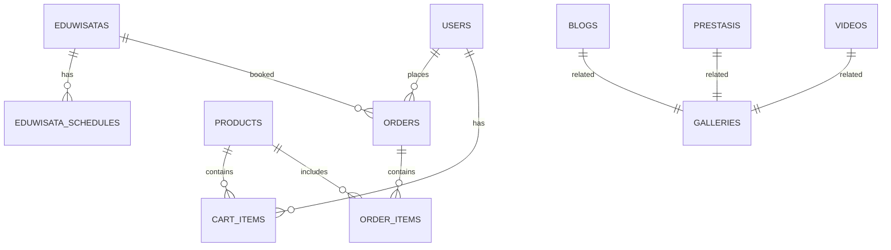

# DOCUMENTASI TEKNIS APLIKASI BOTANI FINAL
## Sistem Informasi Manajemen Pertanian dan Eduwisata

---

## DAFTAR ISI
1. [Informasi Umum](#informasi-umum)
2. [Arsitektur Sistem](#arsitektur-sistem)
3. [Teknologi yang Digunakan](#teknologi-yang-digunakan)
4. [Struktur Database](#struktur-database)
5. [Fitur Utama](#fitur-utama)
6. [API Endpoints](#api-endpoints)
7. [Keamanan](#keamanan)
8. [Instalasi dan Deployment](#instalasi-dan-deployment)
9. [Penggunaan](#penggunaan)
10. [Maintenance](#maintenance)

---

## INFORMASI UMUM

### Deskripsi Aplikasi
Botani Final adalah sistem informasi manajemen pertanian dan eduwisata yang dibangun menggunakan framework Laravel. Aplikasi ini menyediakan platform untuk mengelola produk pertanian, jadwal eduwisata, galeri, blog, dan sistem pemesanan terintegrasi.

### Versi Aplikasi
- **Framework**: Laravel 12.0
- **PHP**: ^8.2
- **Database**: MySQL/PostgreSQL
- **Frontend**: Blade Templates + Tailwind CSS
- **Build Tool**: Vite 6.2.4

### Tim Pengembang
- **Platform**: Laravel Jetstream dengan Livewire
- **Authentication**: Laravel Fortify + Sanctum
- **UI Framework**: Tailwind CSS
- **Database Migration**: Laravel Eloquent ORM

---

## ARSITEKTUR SISTEM

### Arsitektur MVC (Model-View-Controller)
Aplikasi mengikuti pola arsitektur MVC Laravel dengan struktur sebagai berikut:

```
app/
├── Http/Controllers/     # Controller layer
├── Models/              # Model layer (Eloquent ORM)
├── Actions/             # Business logic actions
├── Providers/           # Service providers
└── View/Components/     # Blade components

resources/views/         # View layer (Blade templates)
├── Frontend/           # Public-facing views
├── dashboard/          # Admin panel views
└── layouts/            # Layout templates

database/
├── migrations/         # Database schema
├── seeders/           # Data seeding
└── factories/         # Model factories
```

### Middleware Stack
- **Web Middleware**: Session, CSRF protection, cookie encryption
- **Authentication**: Fortify + Sanctum for API tokens
- **Rate Limiting**: Login throttling (5 requests/minute)
- **Two-Factor Authentication**: TOTP support

---

## TEKNOLOGI YANG DIGUNAKAN

### Backend Technologies
```json
{
    "php": "^8.2",
    "laravel/framework": "^12.0",
    "laravel/jetstream": "^5.3",
    "laravel/sanctum": "^4.0",
    "livewire/livewire": "^3.0",
    "phpoffice/phpspreadsheet": "^4.3",
    "doctrine/dbal": "^4.2"
}
```

### Frontend Technologies
```json
{
    "tailwindcss": "^3.4.0",
    "@tailwindcss/forms": "^0.5.7",
    "@tailwindcss/typography": "^0.5.10",
    "vite": "^6.2.4",
    "axios": "^1.8.2"
}
```

### Development Tools
- **Laravel Pail**: Log viewer
- **Laravel Pint**: Code styling
- **PHPUnit**: Testing framework
- **Faker**: Data generation

---

## STRUKTUR DATABASE

### Entity Relationship Diagram



### Database Tables

#### 1. Users Table
```sql
CREATE TABLE users (
    id BIGINT UNSIGNED PRIMARY KEY AUTO_INCREMENT,
    name VARCHAR(255) NOT NULL,
    email VARCHAR(255) UNIQUE NOT NULL,
    email_verified_at TIMESTAMP NULL,
    password VARCHAR(255) NOT NULL,
    two_factor_secret TEXT NULL,
    two_factor_recovery_codes TEXT NULL,
    two_factor_confirmed_at TIMESTAMP NULL,
    profile_photo_path VARCHAR(2048) NULL,
    created_at TIMESTAMP NULL,
    updated_at TIMESTAMP NULL
);
```

#### 2. Products Table
```sql
CREATE TABLE products (
    id BIGINT UNSIGNED PRIMARY KEY AUTO_INCREMENT,
    name VARCHAR(255) NOT NULL,
    description TEXT NOT NULL,
    price DECIMAL(10,2) NOT NULL,
    unit ENUM('kg','gram','buah','ikat','pack','box','pcs') NOT NULL,
    min_increment DECIMAL(8,2) NOT NULL,
    stock INTEGER NOT NULL DEFAULT 0,
    image VARCHAR(255) NULL,
    featured BOOLEAN DEFAULT FALSE,
    created_at TIMESTAMP NULL,
    updated_at TIMESTAMP NULL
);
```

#### 3. Orders Table
```sql
CREATE TABLE orders (
    id BIGINT UNSIGNED PRIMARY KEY AUTO_INCREMENT,
    nama_pemesan VARCHAR(100) NOT NULL,
    telepon VARCHAR(20) NOT NULL,
    alamat VARCHAR(255) NULL,
    jumlah DECIMAL(10,2) NULL,
    jumlah_orang INTEGER NULL,
    produk_id BIGINT UNSIGNED NULL,
    eduwisata_id BIGINT UNSIGNED NULL,
    total_harga DECIMAL(10,2) NOT NULL,
    status ENUM('menunggu','disetujui','ditolak','selesai') DEFAULT 'menunggu',
    tanggal_kunjungan DATE NULL,
    keterangan VARCHAR(255) NULL,
    created_at TIMESTAMP NULL,
    updated_at TIMESTAMP NULL,
    FOREIGN KEY (produk_id) REFERENCES products(id),
    FOREIGN KEY (eduwisata_id) REFERENCES eduwisatas(id)
);
```

#### 4. Cart Items Table
```sql
CREATE TABLE cart_items (
    id BIGINT UNSIGNED PRIMARY KEY AUTO_INCREMENT,
    session_id VARCHAR(255) NOT NULL,
    user_id BIGINT UNSIGNED NULL,
    product_id BIGINT UNSIGNED NOT NULL,
    quantity DECIMAL(10,2) NOT NULL,
    created_at TIMESTAMP NULL,
    updated_at TIMESTAMP NULL,
    FOREIGN KEY (user_id) REFERENCES users(id),
    FOREIGN KEY (product_id) REFERENCES products(id)
);
```

#### 5. Eduwisatas Table
```sql
CREATE TABLE eduwisatas (
    id BIGINT UNSIGNED PRIMARY KEY AUTO_INCREMENT,
    name VARCHAR(255) NOT NULL,
    description TEXT NOT NULL,
    harga INTEGER NOT NULL,
    image VARCHAR(255) NULL,
    created_at TIMESTAMP NULL,
    updated_at TIMESTAMP NULL
);
```

#### 6. Eduwisata Schedules Table
```sql
CREATE TABLE eduwisata_schedules (
    id BIGINT UNSIGNED PRIMARY KEY AUTO_INCREMENT,
    eduwisata_id BIGINT UNSIGNED NOT NULL,
    date DATE NOT NULL,
    time TIME NOT NULL,
    max_participants INTEGER NOT NULL,
    created_at TIMESTAMP NULL,
    updated_at TIMESTAMP NULL,
    FOREIGN KEY (eduwisata_id) REFERENCES eduwisatas(id)
);
```

#### 7. Blogs Table
```sql
CREATE TABLE blogs (
    id BIGINT UNSIGNED PRIMARY KEY AUTO_INCREMENT,
    title VARCHAR(255) NOT NULL,
    content TEXT NOT NULL,
    image VARCHAR(255) NULL,
    created_at TIMESTAMP NULL,
    updated_at TIMESTAMP NULL
);
```

#### 8. Galleries Table
```sql
CREATE TABLE galleries (
    id BIGINT UNSIGNED PRIMARY KEY AUTO_INCREMENT,
    title VARCHAR(255) NOT NULL,
    image VARCHAR(255) NOT NULL,
    description DATE NOT NULL,
    created_at TIMESTAMP NULL,
    updated_at TIMESTAMP NULL
);
```

#### 9. Contacts Table
```sql
CREATE TABLE contacts (
    id BIGINT UNSIGNED PRIMARY KEY AUTO_INCREMENT,
    name VARCHAR(255) NOT NULL,
    whatsapp VARCHAR(255) NOT NULL,
    subject VARCHAR(255) NOT NULL,
    message TEXT NOT NULL,
    read_at TIMESTAMP NULL,
    created_at TIMESTAMP NULL,
    updated_at TIMESTAMP NULL
);
```

#### 10. Videos Table
```sql
CREATE TABLE videos (
    id BIGINT UNSIGNED PRIMARY KEY AUTO_INCREMENT,
    name VARCHAR(255) NULL,
    title VARCHAR(255) NOT NULL,
    video VARCHAR(255) NOT NULL,
    description TEXT NULL,
    created_at TIMESTAMP NULL,
    updated_at TIMESTAMP NULL
);
```

---

## FITUR UTAMA

### 1. Manajemen Produk
- **CRUD Operations**: Create, Read, Update, Delete produk
- **Stock Management**: Pengelolaan stok otomatis
- **Unit System**: Mendukung berbagai satuan (kg, gram, buah, ikat, pack, box, pcs)
- **Min Increment**: Validasi jumlah minimum pembelian
- **Featured Products**: Produk unggulan untuk homepage
- **Image Upload**: Upload dan resize gambar produk

### 2. Sistem Keranjang Belanja
- **Session-based Cart**: Keranjang berdasarkan session
- **Quantity Validation**: Validasi stok dan increment minimum
- **Real-time Updates**: Update jumlah tanpa refresh
- **Cart Persistence**: Keranjang tersimpan selama session aktif

### 3. Sistem Pemesanan
- **Multi-format Orders**: Pemesanan produk dan eduwisata
- **WhatsApp Integration**: Redirect ke WhatsApp untuk konfirmasi
- **Order History**: Riwayat pemesanan berdasarkan nomor telepon
- **Status Tracking**: Status pesanan (menunggu, disetujui, ditolak, selesai)
- **Export Functionality**: Export data ke Excel

### 4. Eduwisata Management
- **Program Management**: CRUD program eduwisata
- **Schedule System**: Pengelolaan jadwal kunjungan
- **Participant Limits**: Batasan maksimal peserta per jadwal
- **Dynamic Pricing**: Harga berdasarkan jumlah peserta
- **Date-based Filtering**: Filter jadwal berdasarkan tanggal

### 5. Content Management
- **Blog System**: Artikel dan berita
- **Gallery Management**: Galeri foto dengan deskripsi
- **Video Gallery**: Upload dan streaming video
- **Prestasi Section**: Dokumentasi prestasi
- **Contact Management**: Sistem pesan masuk

### 6. Authentication & Authorization
- **Multi-factor Authentication**: TOTP support
- **API Token Management**: Sanctum-based API tokens
- **Profile Management**: Update profil dan foto
- **Session Management**: Secure session handling

---

## API ENDPOINTS

### Authentication Endpoints
```php
// Fortify Routes (Auto-generated)
POST /login
POST /logout
POST /register
POST /forgot-password
POST /reset-password
GET  /user/profile
POST /user/profile-information
POST /user/password
```

### Cart Endpoints
```php
GET    /cart                    # View cart
POST   /cart/add               # Add item to cart
PUT    /cart/{cartItem}        # Update cart item
DELETE /cart/{cartItem}        # Remove cart item
POST   /cart/clear             # Clear cart
GET    /cart/count             # Get cart count (AJAX)
```

### Order Endpoints
```php
POST   /order                  # Create single order
POST   /order/checkout-cart    # Checkout from cart
GET    /riwayat/produk/{telepon}    # Product order history
GET    /riwayat/eduwisata/{telepon} # Eduwisata order history
GET    /order-now/{product}    # Quick order form
```

### Admin Dashboard Endpoints
```php
// Products
GET    /dashboard/product              # List products
POST   /dashboard/product              # Create product
GET    /dashboard/product/{id}/edit    # Edit form
PUT    /dashboard/product/{id}         # Update product
DELETE /dashboard/product/{id}         # Delete product

// Orders
GET    /dashboard/orders               # List orders
PUT    /dashboard/orders/{id}          # Update order status
GET    /dashboard/orders/export        # Export orders

// Eduwisata
GET    /dashboard/eduwisata            # List programs
POST   /dashboard/eduwisata            # Create program
GET    /dashboard/eduwisata/schedule/{id}  # View schedules
POST   /dashboard/eduwisata/schedule/store # Create schedule
DELETE /dashboard/eduwisata/schedule/{id}  # Delete schedule

// Content Management
GET    /dashboard/blog                 # List blogs
POST   /dashboard/blog                 # Create blog
GET    /dashboard/gallery              # List galleries
POST   /dashboard/gallery              # Create gallery
GET    /dashboard/videos               # List videos
POST   /dashboard/videos               # Create video
GET    /dashboard/contact/messages     # List contact messages
```

### Frontend Endpoints
```php
GET /                    # Homepage
GET /product             # Product listing
GET /product/{id}        # Product detail
GET /eduwisata           # Eduwisata listing
GET /eduwisata/schedule  # Schedule listing
GET /blog                # Blog listing
GET /blog/{slug}         # Blog detail
GET /gallery             # Gallery
GET /videos              # Video gallery
GET /contact             # Contact page
GET /perijinan           # Permits page
```

---

## KEAMANAN

### Authentication Security
- **Password Hashing**: Bcrypt hashing untuk password
- **Rate Limiting**: 5 login attempts per minute per IP
- **CSRF Protection**: Token-based CSRF protection
- **Session Security**: Encrypted session cookies
- **Two-Factor Authentication**: TOTP-based 2FA

### Data Validation
```php
// Product validation
'name' => 'required|string|max:255',
'price' => 'required|numeric|min:0',
'unit' => 'required|string|in:kg,gram,buah,ikat,pack,box,pcs',
'min_increment' => 'required|numeric|min:0.01',
'stock' => 'required|integer|min:0'

// Order validation
'nama_pemesan' => 'required|string|max:100',
'telepon' => 'required|string|max:20',
'alamat' => 'nullable|string|max:255',
'jumlah' => 'nullable|numeric|min:0.01'
```

### File Upload Security
- **File Type Validation**: Restrict to specific image/video formats
- **File Size Limits**: Maximum 2MB for images, 500MB for videos
- **Storage Security**: Files stored in public disk with proper permissions
- **Path Sanitization**: Prevent directory traversal attacks

### SQL Injection Prevention
- **Eloquent ORM**: Parameterized queries
- **Query Builder**: Automatic SQL escaping
- **Input Sanitization**: Laravel's built-in XSS protection

---

## INSTALASI DAN DEPLOYMENT

### System Requirements
```bash
# Server Requirements
PHP >= 8.2
MySQL >= 8.0 or PostgreSQL >= 13
Composer >= 2.0
Node.js >= 18.0
NPM >= 9.0

# PHP Extensions
BCMath PHP Extension
Ctype PHP Extension
cURL PHP Extension
DOM PHP Extension
Fileinfo PHP Extension
JSON PHP Extension
Mbstring PHP Extension
OpenSSL PHP Extension
PCRE PHP Extension
PDO PHP Extension
Tokenizer PHP Extension
XML PHP Extension
```

### Installation Steps

#### 1. Clone Repository
```bash
git clone <repository-url>
cd botani_final
```

#### 2. Install Dependencies
```bash
# Install PHP dependencies
composer install --no-dev --optimize-autoloader

# Install Node.js dependencies
npm install
```

#### 3. Environment Configuration
```bash
# Copy environment file
cp .env.example .env

# Generate application key
php artisan key:generate

# Configure database in .env
DB_CONNECTION=mysql
DB_HOST=127.0.0.1
DB_PORT=3306
DB_DATABASE=botani_final
DB_USERNAME=your_username
DB_PASSWORD=your_password
```

#### 4. Database Setup
```bash
# Run migrations
php artisan migrate

# Seed database (optional)
php artisan db:seed

# Create storage link
php artisan storage:link
```

#### 5. Build Assets
```bash
# Build for production
npm run build

# Or for development
npm run dev
```

#### 6. Configure Web Server

##### Apache Configuration
```apache
<VirtualHost *:80>
    ServerName your-domain.com
    DocumentRoot /path/to/botani_final/public
    
    <Directory /path/to/botani_final/public>
        AllowOverride All
        Require all granted
    </Directory>
    
    ErrorLog ${APACHE_LOG_DIR}/botani_error.log
    CustomLog ${APACHE_LOG_DIR}/botani_access.log combined
</VirtualHost>
```

##### Nginx Configuration
```nginx
server {
    listen 80;
    server_name your-domain.com;
    root /path/to/botani_final/public;
    index index.php;

    location / {
        try_files $uri $uri/ /index.php?$query_string;
    }

    location ~ \.php$ {
        fastcgi_pass unix:/var/run/php/php8.2-fpm.sock;
        fastcgi_index index.php;
        fastcgi_param SCRIPT_FILENAME $realpath_root$fastcgi_script_name;
        include fastcgi_params;
    }

    location ~ /\.(?!well-known).* {
        deny all;
    }
}
```

### Production Deployment Checklist
- [ ] Set `APP_ENV=production` in `.env`
- [ ] Set `APP_DEBUG=false` in `.env`
- [ ] Configure proper database credentials
- [ ] Set up SSL certificate
- [ ] Configure backup strategy
- [ ] Set up monitoring and logging
- [ ] Configure queue workers (if using queues)
- [ ] Set up cron jobs for maintenance tasks

---

## PENGGUNAAN

### Admin Panel Access
1. **Login**: Navigate to `/login`
2. **Dashboard**: Access admin features at `/dashboard`
3. **Navigation**: Use sidebar menu for different sections

### Product Management
1. **Add Product**: Dashboard → Products → Create
2. **Edit Product**: Click edit button on product list
3. **Manage Stock**: Update stock quantities in edit form
4. **Featured Products**: Toggle featured status for homepage display

### Order Management
1. **View Orders**: Dashboard → Orders
2. **Update Status**: Use status dropdown to change order status
3. **Export Data**: Click export button for Excel download
4. **Filter Orders**: Use date and status filters

### Eduwisata Management
1. **Create Program**: Dashboard → Eduwisata → Create
2. **Manage Schedules**: Click schedule button for each program
3. **Add Schedule**: Set date, time, and participant limits
4. **View Bookings**: Check order history for eduwisata bookings

### Content Management
1. **Blog Posts**: Dashboard → Blog for article management
2. **Gallery**: Dashboard → Gallery for photo management
3. **Videos**: Dashboard → Videos for video content
4. **Contact Messages**: Dashboard → Contact for message management

### Frontend Features
1. **Product Browsing**: Navigate to `/product`
2. **Shopping Cart**: Add items and manage cart at `/cart`
3. **Order Placement**: Complete checkout process
4. **Order History**: Access via phone number at `/riwayat/produk/{telepon}`

---

## MAINTENANCE

### Regular Maintenance Tasks

#### Daily Tasks
```bash
# Check application logs
tail -f storage/logs/laravel.log

# Monitor disk space
df -h

# Check database connections
php artisan tinker --execute="DB::connection()->getPdo();"
```

#### Weekly Tasks
```bash
# Clear application cache
php artisan cache:clear
php artisan config:clear
php artisan route:clear
php artisan view:clear

# Optimize application
php artisan optimize

# Backup database
php artisan backup:run
```

#### Monthly Tasks
```bash
# Update dependencies
composer update --no-dev
npm update

# Check for security updates
composer audit

# Review and clean old files
php artisan storage:clean
```

### Monitoring and Logging

#### Application Logs
- **Location**: `storage/logs/laravel.log`
- **Rotation**: Daily log rotation configured
- **Level**: Error, Warning, Info, Debug

#### Database Monitoring
```sql
-- Check slow queries
SHOW PROCESSLIST;

-- Monitor table sizes
SELECT 
    table_name,
    ROUND(((data_length + index_length) / 1024 / 1024), 2) AS 'Size (MB)'
FROM information_schema.tables 
WHERE table_schema = 'botani_final';
```

#### Performance Monitoring
- **Response Time**: Monitor average response times
- **Memory Usage**: Track PHP memory consumption
- **Database Queries**: Monitor query performance
- **File Uploads**: Track storage usage

### Backup Strategy

#### Database Backup
```bash
# Automated daily backup
mysqldump -u username -p botani_final > backup_$(date +%Y%m%d).sql

# Using Laravel backup package
php artisan backup:run --only-db
```

#### File Backup
```bash
# Backup uploaded files
tar -czf storage_backup_$(date +%Y%m%d).tar.gz storage/app/public/

# Backup configuration
tar -czf config_backup_$(date +%Y%m%d).tar.gz .env config/
```

### Troubleshooting

#### Common Issues

1. **500 Server Error**
   ```bash
   # Check Laravel logs
   tail -f storage/logs/laravel.log
   
   # Check web server logs
   tail -f /var/log/apache2/error.log
   ```

2. **Database Connection Issues**
   ```bash
   # Test database connection
   php artisan tinker --execute="DB::connection()->getPdo();"
   
   # Check database configuration
   php artisan config:show database
   ```

3. **File Upload Issues**
   ```bash
   # Check storage permissions
   chmod -R 775 storage/
   chown -R www-data:www-data storage/
   
   # Recreate storage link
   php artisan storage:link
   ```

4. **Cache Issues**
   ```bash
   # Clear all caches
   php artisan cache:clear
   php artisan config:clear
   php artisan route:clear
   php artisan view:clear
   ```

---

## KESIMPULAN

Aplikasi Botani Final adalah sistem informasi manajemen pertanian dan eduwisata yang komprehensif dengan fitur-fitur modern dan keamanan yang robust. Aplikasi ini menggunakan teknologi terbaru seperti Laravel 12, PHP 8.2, dan Tailwind CSS untuk memberikan pengalaman pengguna yang optimal.

### Keunggulan Sistem
1. **Scalable Architecture**: Arsitektur MVC yang mudah dikembangkan
2. **Security First**: Implementasi keamanan yang komprehensif
3. **User-Friendly**: Interface yang intuitif untuk admin dan pengguna
4. **Mobile Responsive**: Desain yang responsif untuk berbagai perangkat
5. **Integration Ready**: Siap untuk integrasi dengan sistem eksternal

### Rekomendasi Pengembangan
1. **API Development**: Pengembangan REST API untuk mobile app
2. **Payment Gateway**: Integrasi payment gateway untuk pembayaran online
3. **Notification System**: Sistem notifikasi email/SMS
4. **Analytics Dashboard**: Dashboard analitik untuk insights bisnis
5. **Multi-language Support**: Dukungan multi-bahasa

---

**Dokumen ini dibuat pada**: {{ date('Y-m-d H:i:s') }}  
**Versi Dokumen**: 1.0  
**Terakhir Diperbarui**: {{ date('Y-m-d H:i:s') }} 